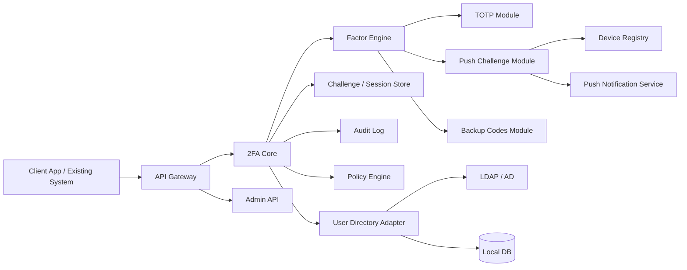

# Архитектура сервисов

## Рекомендуемый контур

## Формат реализации на старте

Для `MVP` практичнее делать не набор независимых микросервисов, а `modular monolith`:

- один backend-процесс
- отдельные модули по доменам
- единая база данных
- отдельные очереди и адаптеры, где это нужно

Такой старт дешевле в разработке и сопровождении, но не мешает позже вынести `push`, `audit` или `integration adapters` в отдельные сервисы.

## Сервисные зоны

### 1. API Gateway

Функции:

- единая точка входа
- аутентификация клиентов интеграции
- rate limiting
- версионирование `API`
- маршрутизация на внутренние сервисы

### 2. 2FA Core

Главный оркестратор сценариев:

- создает `challenge`
- определяет, какой фактор нужен по политике
- отслеживает статус `pending / approved / denied / expired`
- возвращает результат во внешнюю систему

### 3. Factor Engine

Слой выполнения факторов:

- запуск проверки `TOTP`
- отправка `push challenge`
- проверка `backup codes`
- позже подключение `WebAuthn`

### 4. Policy Engine

Решает, когда именно нужен второй фактор:

- всегда
- только для админов
- только при новом устройстве
- только при риск-событии
- step-up для чувствительных операций

### 5. Device Registry

Хранит устройства пользователя:

- device id
- публичные ключи или токены доставки
- платформа `iOS/Android`
- статус доверия
- привязка к пользователю и приложению

### 6. Notification Service

Функции:

- отправка `push`
- шаблоны сообщений
- повторные попытки
- отложенная обработка отказов провайдера

### 7. Audit Log

Нужен для безопасности и коробочной поставки:

- кто запустил проверку
- какой фактор использован
- какой клиент вызвал `API`
- итог и причина отказа
- `IP`, `device`, `tenant`, correlation id

## Базовый сценарий входа

1. Внешняя система проверяет первый фактор.
2. Внешняя система вызывает `2FA Core`.
3. Ядро выбирает фактор по политике.
4. Создается `challenge`.
5. Пользователь подтверждает его через `push` или вводит `TOTP`.
6. Ядро возвращает во внешнюю систему финальный статус.

## Почему это лучше монолита OTP

- легче подключать новые факторы
- проще делать коробочную и облачную поставку из одной кодовой базы
- интеграционный слой остается стабильным при эволюции внутренних модулей
- можно добавлять риск-аналитику и step-up без переписывания клиентов

## Технический стек по умолчанию

Если стартовать быстро и прагматично:

- backend: `ASP.NET Core` или `NestJS`
- database: `PostgreSQL`
- cache/challenge store: `Redis`
- queue: `RabbitMQ` или `Redis Streams`
- mobile push: `Firebase Cloud Messaging` и `APNs`
- observability: `OpenTelemetry` + `Prometheus` + `Grafana`
