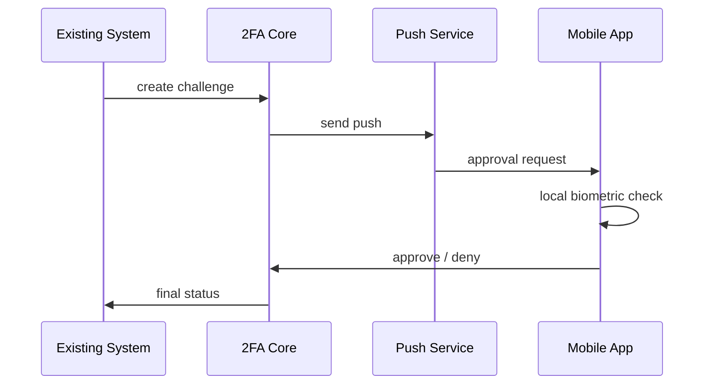

# Мобильное приложение

## Роль приложения

Смартфон должен быть не просто генератором кодов, а полноценным контейнером второго фактора.

## Функции первой очереди

- генерация `TOTP`
- получение `push`-запросов на подтверждение
- подтверждение или отклонение входа
- локальная биометрическая проверка перед `approve`
- отображение истории последних подтверждений

## Сценарий привязки устройства

1. Пользователь входит в систему.
2. Открывает подключение второго фактора.
3. Сервер выдает `QR` или activation code.
4. Приложение сканирует код.
5. Устройство регистрируется в `Device Registry`.
6. Пользователь подтверждает enrollment.

## Push-сценарий

## Безопасность приложения

- хранение чувствительных данных в `Secure Enclave / Keychain / Keystore`
- обязательная локальная защита приложения `PIN/biometric`
- device binding
- защита от root/jailbreak по возможности
- отзыв устройства администратором или пользователем

## Offline-режим

Нужен обязательно. Если `push` недоступен:

- пользователь вводит `TOTP`
- система продолжает работать без мобильной сети

## Рекомендуемый стек

- `Flutter` если нужен один код для `iOS/Android`
- `Kotlin + Swift`, если критичны native-возможности и безопасность на уровне платформ

Если команда небольшая и нужен быстрый старт, pragmatic choice: `Flutter` для `MVP`, а дальше смотреть по ограничениям безопасности и UX.
