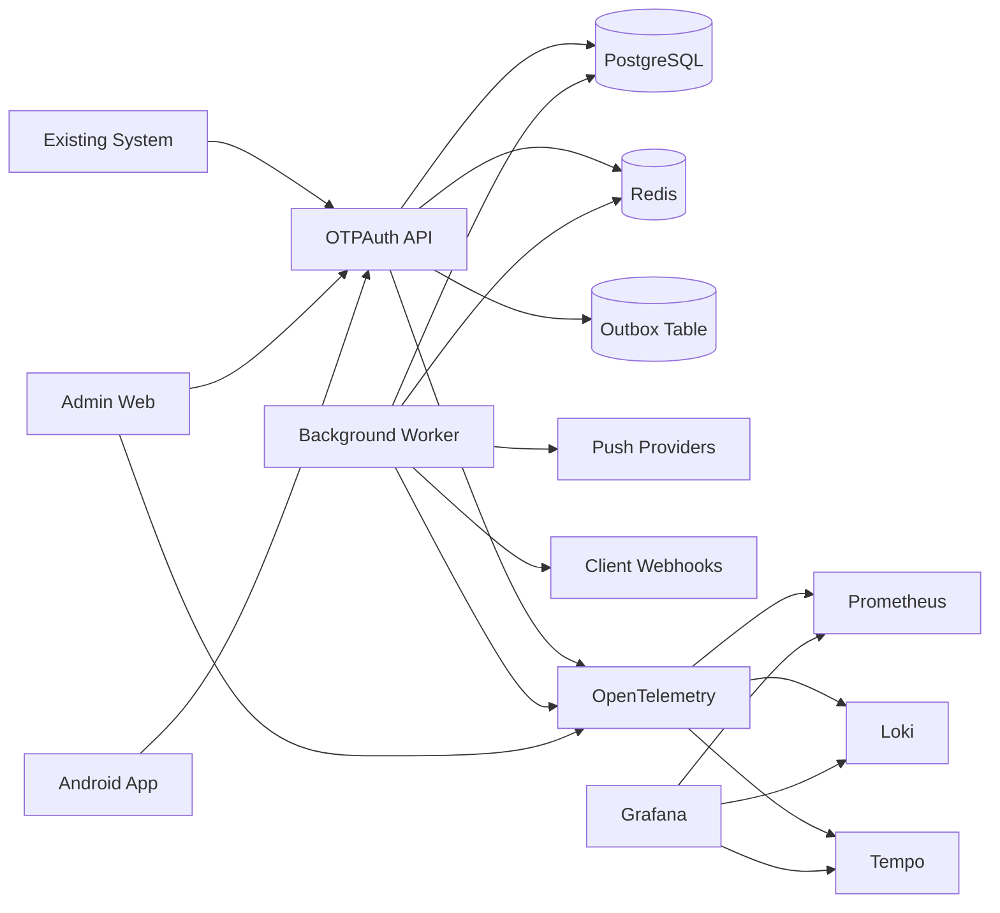

# Deployment Topology MVP

## Логическая схема

## Deployable units

### 1. API

Основной backend:

- `Integration API`
- `Auth/Token`
- `Challenges`
- `Enrollments`
- `Devices`
- `Policy`
- `Audit`

### 2. Worker

Фоновые задачи:

- чтение `outbox`
- отправка `push`
- повтор webhook-ов
- cleanup expired challenge
- фоновая доставка аудит-событий при необходимости

### 3. Admin Web

- админская панель
- self-service позже

### 4. Android App

- `TOTP`
- `push approval`
- device lifecycle

## Data plane

### PostgreSQL

Хранит:

- пользователей
- интеграционных клиентов
- факторы
- устройства
- challenges
- audit
- outbox

### Redis

Хранит:

- rate limits
- anti-replay keys
- runtime throttling
- короткоживущие session/runtime ключи

## Почему без RabbitMQ

На этой схеме worker получает задачи из `PostgreSQL outbox`, а не из внешнего брокера.

Это дает:

- меньше инфраструктуры
- проще коробочную установку
- меньше операционных точек отказа

## Когда добавлять RabbitMQ

Только если появятся реальные признаки:

- большой объем фоновых задач
- несколько независимых consumers
- сложные retry и routing policies
- потребность отделить delivery pipeline от основной БД
