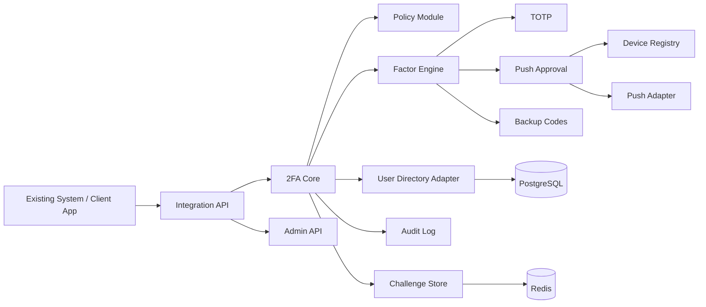

# Service Architecture

## Формат реализации на старте

Первая реализация идет как `modular monolith`.

Доменные модули:

- `Integration API`
- `2FA Core`
- `Factor Engine`
- `Policy`
- `Device Registry`
- `Audit`
- `Admin`

## Логический контур

## Ответственность модулей

### Integration API

- прием запросов от внешних систем
- аутентификация клиентов интеграции
- выдача `challenge`
- получение статуса
- прием callback-действий от мобильного клиента

### 2FA Core

- оркестрация сценариев подтверждения
- управление жизненным циклом `challenge`
- согласование с политиками и факторами
- финальный статус для внешней системы

### Factor Engine

- запуск конкретного механизма фактора
- проверка `TOTP`
- проверка `backup code`
- постановка `push challenge`

### Policy

- выбор обязательности второго фактора
- step-up правила
- ограничения по типу клиента, пользователю, операции и deployment profile
- запрет небезопасных сценариев по `deny by default`
- проверка допустимости `push` и device trust state

### Device Registry

- регистрация устройств
- управление токенами доставки
- отзыв и состояние доверия устройства

### Audit

- фиксация критичных событий
- экспорт для расследований и `SIEM`

### Admin

- human-operator auth contour
- operator-facing enrollment and support flows
- отдельная role/permission model для административных действий
- browser-facing session model, не совпадающая с integration auth

## Базовый runtime stack

- backend: `ASP.NET Core`
- primary DB: `PostgreSQL`
- volatile state: `Redis`
- async execution: `Outbox + Background Worker`
- mobile: `Kotlin Android`
- notifications: `FCM` first, `APNs` later when `iPhone` enters scope
- observability: `OpenTelemetry`, `Prometheus`, `Grafana`, `Loki`, `Tempo`

## Почему не микросервисы на старте

- ниже операционная сложность
- быстрее собрать `MVP`
- меньше стоимость изменений в доменной модели
- сохраняется возможность позже вынести `push`, `audit` или интеграционные адаптеры в отдельные сервисы

## Почему не внешний `Policy Engine` в `MVP`

- policy нужен уже сейчас, но как внутренний модуль, а не как отдельная платформа правил
- это упрощает debugging, explainability и security review
- для первой версии достаточно code-first правил с ограниченной конфигурацией
