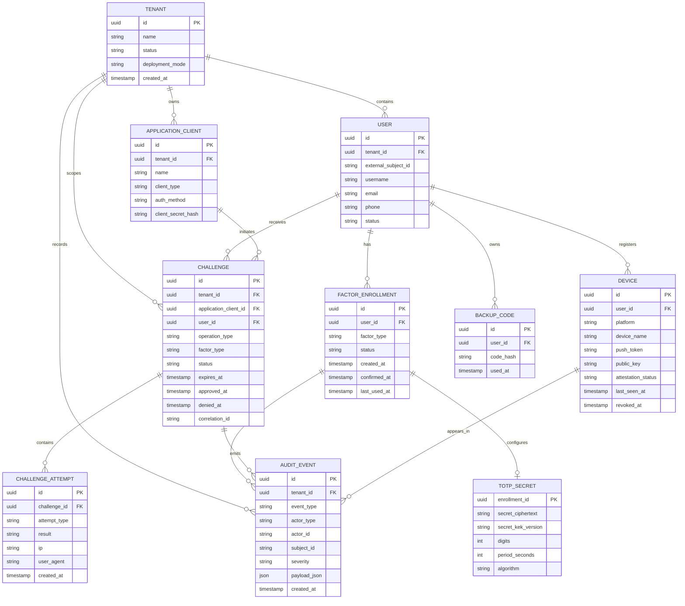

# ERD

## Комментарии

- `TOTP_SECRET` выделен отдельно, чтобы проще изолировать доступ к чувствительным данным.
- `Challenge` является центром runtime-процесса.
- `AuditEvent` намеренно отделен от бизнес-таблиц и должен проектироваться с учетом долгого хранения и экспорта.
